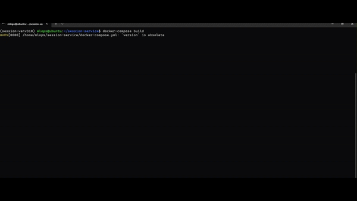

<!-- Banner -->
<p align="center">
  <a href="https://www.uit.edu.vn/" title="Trường Đại học Công nghệ Thông tin" style="border: none;">
    
  </a>
</p>

# Group members
| STT    | MSSV          | Họ và Tên              |  Email                  |
| ------ |:-------------:| ----------------------:|-------------------------:
| 1      | 22520273      | Nguyễn Viết Đức        |22520273@gm.uit.edu.vn   |
| 2      | 22520459      | Đoàn Văn Hoàng         |22520459@gm.uit.edu.vn   |
| 3      | 22520862      | Huỳnh Nhật Minh        |22520862@gm.uit.edu.vn   |

# Session-Service

Session-based recommendation API built with FastAPI, Polars, and LightGBM.  

## Repository Main Structure

```
.
├── Dockerfile
├── docker-compose.yml
├── main.py
├── process_pipeline.py     #  Polars feature‐engineering pipeline
├── requirements.txt
├── model/
│   └── lgbm_ranker.joblib  # pre‐trained LightGBM ranking model
└── README.md
```

---

## Quickstart

### How to install

### 1. Local Python Run

```bash
# create new venv(python 3.10) (if needed)

## Build python 3.10 (if you don't have)
sudo apt update
sudo apt install -y wget build-essential libssl-dev zlib1g-dev \
  libncurses5-dev libbz2-dev libreadline-dev libsqlite3-dev curl \
  libffi-dev liblzma-dev tk-dev
cd /usr/src
sudo wget https://www.python.org/ftp/python/3.10.13/Python-3.10.13.tgz
sudo tar xzf Python-3.10.13.tgz
cd Python-3.10.13
sudo ./configure --enable-optimizations
sudo make -j$(nproc)
sudo make altinstall

## create new virtual venv avoid conflicts
python3.10 -m venv .venv
source .venv/bin/activate

# (from /usr/src/Python-3.10.13)
cd ~/mlops-session-service 

# Install deps
pip install -r requirements.txt

# then start Uvicorn
uvicorn main:app --reload --host 127.0.0.1 --port 8000
```
Open your browser at `http://127.0.0.1:8000/docs` to test the API.

### 2. Docker & Compose

```bash
# build service images
docker-compose build

# launch app
docker-compose up -d

# follow logs
docker-compose logs -f app
```

Swagger UI: `http://127.0.0.1:8000/docs` to test the API.

## 3. DockerHub
```bash
# Pull docker image 
docker pull 22520273/session-service-app

# Run docker
docker run -d -p 8888:8000 --name session_service 22520273/session-service-app:latest

# Go to `http://localhost:8888/docs` to test the API

# Check run
docker ps

# Check log  --name
docker logs session_service

```


---
### DEMO DOCKER SERVING
[]


## API Usage

### Endpoint

POST `/recommendations`

Request model:
```json
{
  "session_id": 12345,
  "current_events": [
    {"aid": 101, "ts": 1661119200, "type": 0},
    {"aid": 202, "ts": 1661119300, "type": 1}
  ],
  "top_k": 5
}
```

- `session_id` (int): unique session identifier  
- `current_events` (array of `{aid, ts, type}`): user's past interactions  
- `top_k` (int, default 20): number of recommendations to return

Response model:
```json
{
  "session_id": 12345,
  "recommendations": [
    {"aid": 54321, "score": 1.2345},
    {"aid": 98765, "score": 1.1234},
    …
  ]
}
```
